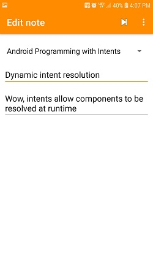
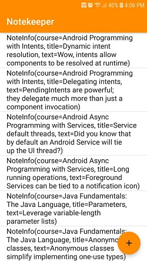

# Notekeeper-GADS2021-part-1

This is a custom app base on Pluralsight course:
Developing Android Basics with Kotlin: Geting started

In this custom app, you will be introduced to Fragments and how to navigate and passing data between fragment and much more.

edit notes                                              |  all notes
:----------------------------------------------------:|:-------------------------:
  |  

